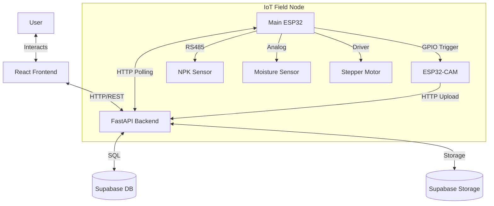

# SmartAgriNode Hardware Integration Plan

This document outlines the comprehensive strategy to integrate the ESP32-based sensor node and camera module with the existing SmartAgriNode web application.

## 1. System Architecture

The system will transition from a purely manual input system to a hybrid IoT system.

---

## 2. Database Schema Updates (Supabase)

To effectively manage real-time data and link sensor readings with images, we need a new table structure. We shouldn't just dump data into the existing history tables immediately; instead, we should group them into "Field Scans".

### New Table: `field_scans`
This table acts as a session container for a single data collection event.

| Column | Type | Description |
|--------|------|-------------|
| `id` | UUID | Primary Key |
| `user_id` | UUID | Foreign Key to auth.users |
| `status` | Text | 'pending', 'processing', 'completed', 'failed' |
| `n_val` | Float | Nitrogen value |
| `p_val` | Float | Phosphorus value |
| `k_val` | Float | Potassium value |
| `moisture` | Float | Moisture/Humidity |
| `temp` | Float | Temperature (if available) |
| `ph` | Float | pH Level |
| `image_url` | Text | URL of the raw uploaded image |
| `processed_image_url` | Text | URL of the image with bounding boxes |
| `weed_count` | Int | Number of weeds detected |
| `crop_recommendation` | Text | Result from ML model |
| `created_at` | Timestamp | Time of scan initiation |

---

## 3. Backend Implementation Strategy

We need to create a dedicated router for IoT devices to handle the specific communication patterns of the ESP32s.

### 3.1 State Management
Since the ESP32 polls for commands, the backend needs to know if a user has requested a scan.
*   **Approach:** Use a simple in-memory dictionary or a database flag to track "Active Scan Requests" for a specific user/device.

### 3.2 New API Endpoints

#### A. `POST /api/device/scan/start` (Frontend -> Backend)
*   **Action:** User clicks "Start Scan" on UI.
*   **Logic:** Creates a new entry in `field_scans` with status `pending`. Sets an internal flag `COMMAND_QUEUE = "START"`.
*   **Returns:** `scan_id`.

#### B. `GET /api/device/command` (Main ESP32 -> Backend)
*   **Action:** ESP32 polls this every 2-3 seconds.
*   **Logic:** Checks `COMMAND_QUEUE`.
*   **Returns:** `"START"` (if pending) or `"STOP"`.

#### C. `POST /api/device/upload-image` (ESP32-CAM -> Backend)
*   **Action:** Camera uploads the raw JPEG.
*   **Logic:** 
    1. Receives raw bytes.
    2. Saves to Supabase Storage (`scans/raw/{scan_id}.jpg`).
    3. **Trigger:** Immediately runs the **Weed Detection Model** on this image.
    4. Updates `field_scans` with `image_url`, `processed_image_url`, and `weed_count`.

#### D. `POST /api/device/telemetry` (Main ESP32 -> Backend)
*   **Action:** Main ESP32 sends NPK + Moisture data.
*   **Logic:**
    1. Updates `field_scans` with sensor values.
    2. **Trigger:** Checks if all data (Image + Sensors) is present.
    3. If yes, runs the **Crop Recommendation Model**.
    4. Updates `field_scans` with `crop_recommendation`.
    5. Sets status to `completed`.

---

## 4. Hardware Logic Refinement

### Main ESP32 Code Adjustments
The current code is good, but we need to ensure it sends data *after* the camera has likely finished, or we handle the asynchronous nature on the backend.

**Flow:**
1.  **Poll:** `checkServerCommand()` returns "START".
2.  **Action:**
    *   Move Stepper.
    *   Trigger Camera (Pulse HIGH).
    *   *Wait 5-8 seconds* (Give camera time to connect WiFi, snap, and upload).
    *   Read Sensors (NPK, Moisture).
    *   Send Sensor Data to `/api/device/telemetry`.
3.  **Reset:** Go back to polling.

### ESP32-CAM Code Adjustments
The camera code sends raw bytes. The backend endpoint must be prepared to read `request.body` directly or handle `multipart/form-data` if we change the C++ code.
*   **Recommendation:** Keep sending raw bytes (binary) as it's faster for the ESP32. The backend `UploadFile` can handle this, or we use `Request.stream()`.

---

## 5. Frontend UI/UX: "Live Field Monitor"

We will introduce a new page: **"Live Monitor"**.

### User Flow
1.  **Dashboard:** User sees a "Connect to Field Node" or "Live Monitor" card.
2.  **Live Monitor Page:**
    *   **Status Bar:** Shows "Device Status: Online/Offline" (determined by last poll time).
    *   **Control:** A large, prominent "START SCAN" button.
    *   **Live Feed (Simulated):**
        *   When "Start" is clicked, show a progress stepper:
            1.  *Sending Command...*
            2.  *Moving to Position...*
            3.  *Capturing Image...*
            4.  *Analyzing Soil & Weeds...*
            5.  *Done!*
    *   **Results View:**
        *   **Left Panel:** The captured image with bounding boxes (Weed Detection).
        *   **Right Panel:** Real-time gauges for N, P, K, Moisture.
        *   **Bottom Panel:** The AI Crop Recommendation based on this specific scan.

### Technical Implementation (Frontend)
*   **Polling/Realtime:** The frontend needs to know when the backend has finished processing the scan.
*   **Supabase Realtime:** We can subscribe to changes on the `field_scans` table. When the backend updates the status to `completed`, the frontend automatically updates the UI without the user refreshing.

---

## 6. Implementation Plan

### Phase 1: Backend & Database (Foundation)
1.  Create `field_scans` table in Supabase.
2.  Create `backend/routers/device.py`.
3.  Implement the command polling endpoint.
4.  Implement the telemetry and image upload endpoints.
5.  Integrate the ML models to run automatically when data arrives.

### Phase 2: Hardware Integration (Connectivity)
1.  Update Main ESP32 code to hit the new `/api/device/command` and `/api/device/telemetry`.
2.  Update ESP32-CAM code to hit `/api/device/upload-image`.
3.  Test the full loop with a local server (laptop IP).

### Phase 3: Frontend Development (Interface)
1.  Create `LiveMonitor.jsx` component.
2.  Implement the "Start Scan" API call.
3.  Implement Supabase Realtime subscription to watch for scan results.
4.  Visualize the incoming data using the existing Gauge and Chart components.

### Phase 4: Deployment & Tuning
1.  Deploy backend to cloud (Render/Railway).
2.  Update ESP32 firmware with production URL.
3.  Calibrate sensor timings (ensure camera uploads before backend tries to finalize the scan).

## 7. Summary of Changes Required

| Component | Change |
|-----------|--------|
| **Database** | Add `field_scans` table. |
| **Backend** | Add `device.py` router, logic to merge async data streams. |
| **Frontend** | Add `LiveMonitor` page, Realtime subscription logic. |
| **ESP32** | Update endpoints, tune delays. |
